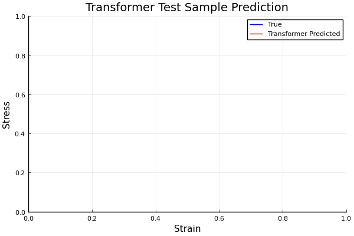

# Wav-KAN Sequence

MLP and Wavelet KAN implementations of the Transformer and Recurrent Neural Operator (RNO) in Julia, applied to a 1D viscoelastic unit cell problem (strain-to-stress mapping).

Built with [Lux.jl](https://github.com/LuxDL/Lux.jl) and [Reactant.jl](https://github.com/EnzymeAD/Reactant.jl).

## Usage

```bash
# Train
julia --project=. main.jl RNO          # or KAN_RNO, Transformer, KAN_Transformer

# Tune hyperparameters
julia --project=. tune.jl RNO

# Predict + visualise
julia --project=. predict.jl KAN_RNO

# Compare models
julia --project=. compare.jl
```

Configs live in `config/` as `.ini` files.

## Problem

Dataset from the Cambridge Engineering Part IIB course on [Data-Driven Methods in Mechanics and Materials](https://teaching.eng.cam.ac.uk/content/engineering-tripos-part-iib-4c11-data-driven-and-learning-based-methods-mechanics-and).

The dataset consists of the unit cell of a three-phase viscoelastic composite material. The objective is to learn the macroscopic constitutive relation that maps the strain field $\epsilon(x,t)$ to the stress field $\sigma(x,t)$. The stress is governed by:

$$\sigma(x,t) = E(x)\epsilon(x,t) + v(x) \frac{\partial u(x,t)}{\partial t}$$

where $E(x)$ is Young's modulus and $v(x)$ is viscosity, both piecewise constant across the three phases. This dataset is difficult for the Transformer to learn, but straightforward for the RNO.

<table align="center">
<tr>
<td align="center"></td>
<td align="center"></td>
</tr>
<tr>
<td align="center"><em>Transformer. 4,209,205 params, purely data-driven</em></td>
<td align="center"><em>Recurrent Neural Operator. 52 params + inductive bias</em></td>
</tr>
</table>

## References

- [Bozorgasl & Chen (2024). Wav-KAN: Wavelet Kolmogorov-Arnold Networks.](https://arxiv.org/abs/2405.12832)
- [Liu et al. (2024). KAN: Kolmogorov-Arnold Networks.](https://arxiv.org/abs/2404.19756)
- [Liu & Cicirello (2024). Cambridge 4C11 Course.](https://teaching.eng.cam.ac.uk/content/engineering-tripos-part-iib-4c11-data-driven-and-learning-based-methods-mechanics-and)
